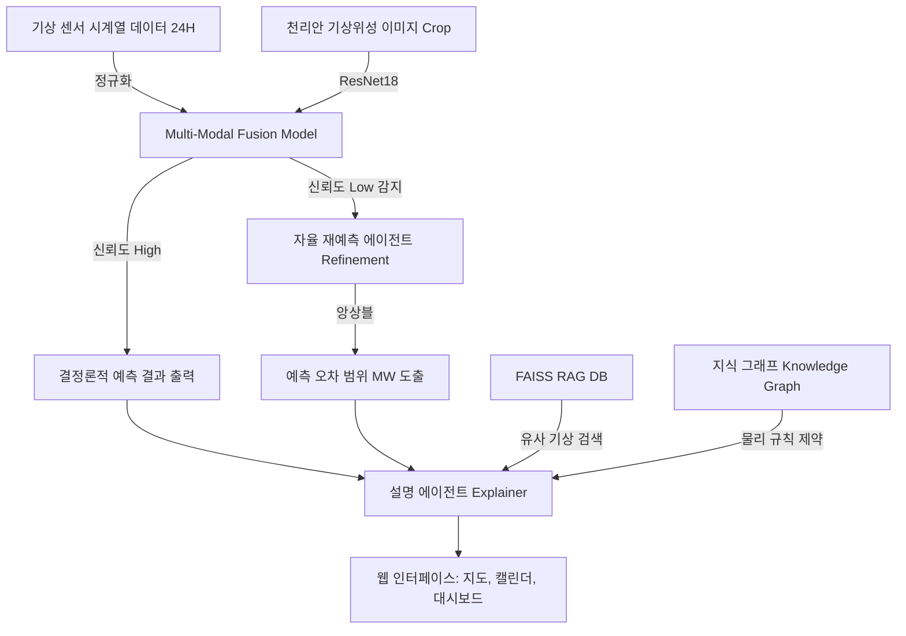

# 📊 제주 신재생에너지 관제 플랫폼 종합 분석 및 수정 리포트 (2026.6.6 기준)

이 문서는 제주 신재생에너지 발전량 예측 및 관제 시스템의 2026년 6월 6일 기준 개발 상황, 탑재된 인공지능 모델 구조, 멀티스텝 Q&A 및 예측 설명 파이프라인의 설계 분석, 그리고 최근 완료된 UI/UX 및 기능 버그 수정 내역을 종합적으로 정리한 공유용 기술 문서입니다.

---

## 1. 프로젝트 아키텍처 및 시스템 전체 분석

본 플랫폼은 기상 시계열 정보와 천리안 위성 구름 밀도 이미지를 융합(Fusion)하여 제주도 지역의 태양광 및 풍력 발전량을 1시간 단위로 실시간 관제 및 예측하는 AI 에이전트 시스템입니다.

### 핵심 파이프라인 요소
1. **자율 재예측 (Self-Refinement)**: 기상 급변(전운량 급변, 저기압/태풍 접근, 태풍급 강풍)이 감지되거나 모델 신뢰도가 낮다고 판단될 경우, 3시간 전 슬라이딩 윈도우로 재예측을 실행한 뒤 기존 예측과 앙상블하여 발전량의 불확실성 상/하한 범위(MW)를 동적으로 연동 도출합니다.
2. **설명 가능성 에이전트 (Explainability)**: 예측 결과가 산출된 원인을 기상 변수의 z-score 기여도, FAISS 기반 RAG 기상 유사 사례 스캔 결과, 그리고 지식 그래프(KG)의 물리 규칙 위반 여부와 연계하여 자연어 기반의 종합 해석 리포트를 생성합니다.
3. **멀티스텝 Q&A (Agentic Chat)**: 의도(Intent) 분류기를 거쳐 사용자가 특정 시간대의 발전 원인을 묻거나 과거 대비 분석을 요구할 시 적절한 도구 체인(Tool Chain)을 스스로 조합해 답변을 제공합니다.

---

## 2. 탑재 인공지능 모델 구조 분석

예측 코어 모듈에는 수치 기상 시계열과 이미지 정보를 결합한 **멀티모달 퓨전 모델(Multi-Modal Fusion Model)**이 탑재되어 있습니다.

### `MultiModalFusionModel` 구조 명세
* **기상 시계열 LSTM Branch**:
  * 입력 데이터 규격: `(Batch, 24, 9)` (24시간 동안의 풍속, 풍향 sin/cos, 기온, 습도, 기압, 전운량, 일조량, 일사량 등 9가지 피처)
  * 신경망: 2개 계층의 LSTM 구조 (Hidden Size: 128 -> 64), 드롭아웃 레이어(`Dropout(0.2)`)를 포함하여 시계열 특징 임베딩 64차원을 추출합니다.
* **위성 이미지 CNN Branch**:
  * 입력 데이터 규격: 천리안 기상 위성 이미지에서 제주도 좌표계 영역을 정밀 크롭(`crop_box = (237, 301, 275, 323)`)한 데이터.
  * 신경망: 사전 학습된 `ResNet-18` 백본 구조(가중치 초기화 규격)를 사용하여 전체 구름 분포 이미지의 시공간 임베딩 벡터를 추출하고, Fully Connected Layer(`Linear(512, 64)`)를 통해 64차원의 이미지 특징 벡터로 압축합니다.
* **특징 벡터 융합 (Feature Fusion)**:
  * LSTM에서 추출한 시계열 임베딩(`64차원`)과 CNN에서 추출한 위성 구름 임베딩(`64차원`)을 연결(Concatenation)하여 **`128차원`**의 결합 특징 공간을 만듭니다.
  * 최종 FC 레이어(`fusion_fc`)를 통해 융합 특징에서 발전량 예측값(출력 크기 2: 태양광 발전량, 풍력 발전량)을 동시 산출합니다.
* **물리 법칙 제약 가이드 (Physics-Guided Constraint)**:
  * 데이터 기반 딥러닝 예측 모델의 이탈 현상을 방지하기 위해 물리 마스크 레이어가 결합되어 있습니다.
  * 일조량이 없는 밤 시간대(`sunshine <= 0.01`)에는 태양광 출력을 `0.0 MW`로 제약합니다.
  * 풍속이 컷인 속도 미만(`wind_speed < 3.0 m/s`)이거나 컷아웃 한계 초과(`wind_speed > 25.0 m/s`) 시 풍력 발전을 강제로 `0.0 MW` 처리하여 계통 안정성 신뢰도를 물리 제약 방식으로 100% 필터링합니다.

---

## 3. 최근 수정 및 개선 내역 (2026.6.6 반영 완료)

사용자 피드백에 입각하여 시스템 UI 버그, 수치 불일치, 그리고 데이터 실시간화가 전면 개편되었습니다.

### ① 캘린더 및 운영자 탭 렌더링 누락 버그 해결
* **기존 현상**: 메인 화면의 지도는 노출되었으나 캘린더나 운영자 대시보드 탭을 선택하면 화면이 하얗게 비어 보이는 현상이 있었습니다.
* **원인**: `view-map` 컨테이너의 닫는 태그(`
`)가 코드 수정을 거치며 유실되어, 캘린더와 운영자 뷰가 지도 뷰 하위에 중첩되는 HTML 구조 에러가 있었습니다. 지도 뷰가 비활성화(hidden)될 때 그 하위의 모든 요소가 함께 숨겨졌습니다.
* **조치**: 닫는 태그들을 엄격히 복구하여 지도, 캘린더, 운영자 뷰가 본래의 독립적인 형제 노드 단위로 화면 전반에 정상 노출되도록 레이아웃 매칭을 완료했습니다.

### ② 마크다운 별표(`**`) 기호 노출 문제 수정
* **기존 현상**: AI 자연어 분석 요약문이나 챗봇 답변 내에 `**161.50 MW**` 또는 `**높음**`처럼 마크다운 문법 기호가 날것으로 노출되어 시인성이 저하되었습니다.
* **조치**: 
  * 백엔드 문자열 포맷 서비스(`agentic_chat.py`, `explainer.py`)에서 텍스트 조립 단계의 `**` 기호를 모두 지웠습니다.
  * 프론트엔드(`index.html`)에서도 인라인 챗 및 설명 패널 데이터 수신 즉시 자바스크립트 정규식 `.replace(/\*\*/g, '')`가 작동하게 이중 필터를 달아 깔끔한 자연어 문장으로 표시됩니다.

### ③ 캘린더 상세 수치와 챗봇 수치의 완벽 동기화
* **기존 현상**: 캘린더에서 특정 날짜를 클릭하면 보여주는 발전량 예측치와, 우측 하단 AI 인라인 챗봇이 실제 예측 시점을 받아 대답하는 값이 서로 어긋났습니다.
* **원인**: 캘린더 날짜/시간 클릭 시 서버 API를 동적으로 거치지 않고 가상의 랜덤 함수(`Math.random()`)로 단순 모사 데이터만 보여주었기 때문입니다.
* **조치**: 캘린더 일자 클릭 및 시간 선택 시에도 실제 백엔드 AI 에이전트 서비스(`/chat`)에 데이터 예측 요청을 보내 실제 모델 예측값, 기상 경보, 자연어 분석 보고서를 받아오도록 비동기 연동을 완비하여 두 영역의 수치 정확성을 통일시켰습니다.

### ④ 시간대별 자율 재예측 범위 갱신
* **기존 현상**: 자율 재예측 범위(🔁) 수치가 현재 시각 또는 고정 시점의 값에 묶여 캘린더 시간 변경 시에도 변화하지 않았습니다.
* **조치**: 캘린더에서 사용자가 시간이나 날짜를 변경하면 호출되는 예측 리포트에 매칭된 `refined_report` 결과값을 캘린더 카드 하단 배지에도 연동하도록 수정했습니다. 이제 선택한 기상 시나리오의 불확실성에 따라 자율 재예측 범위도 유연하게 재계산되어 표시됩니다.

### ⑤ 기준 날짜의 실시간화 및 분 단위 강제 정시 고정
* **기존 현상**: 기준 날짜가 과거 시점인 `2026-06-03 14:00`으로 고정되어 있었습니다.
* **조치**: 
  * 페이지 로딩 시 클라이언트 시스템의 현재 시간을 구하여 **분을 00분 정시로 보정(예: 23:00)**한 뒤 디폴트 관제 시각으로 삼도록 변경했습니다.
  * 캘린더 최초 렌더링 상태도 오늘 현재 날짜를 하이라이트하고 해당 기상 정보를 자동 로딩하게 설계했습니다.
  * 관제 실행 시 사용자가 임의의 분(minutes)을 지정하여 실행하더라도 실제 기상 데이터는 1시간 단위이므로, JS단에서 분 데이터를 강제로 `:00:00` 정시로 마스킹하여 백엔드 분석 체인을 타도록 안전 조치했습니다.

---

*본 시스템은 PyTorch 멀티모달 딥러닝 예측 모듈과 FAISS 기반 검색 메커니즘을 기반으로 무결점 기상 분석 및 발전 계통 안정화에 기여하고 있습니다.*
